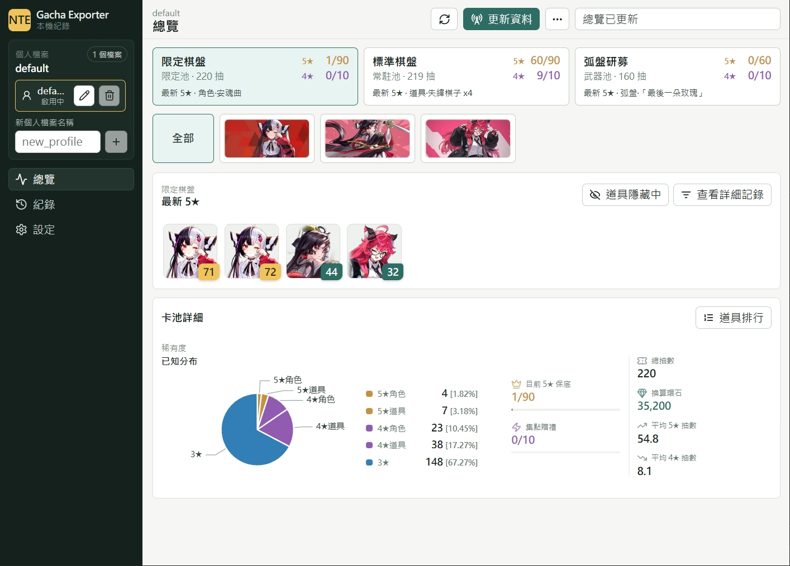

# NTE Gacha Exporter | 異環抽卡紀錄導出

繁體中文 | [English](https://github.com/Anong0u0/nte_gacha_exporter/blob/master/docs/README.en.md)

使用 Windows pktmon 擷取異環封包，匯出限定棋盤、標準棋盤、弧盤研募紀錄，產生 JSON/CSV。

## 特色

- GUI，紀錄分析、瀏覽、篩選
- 自動翻頁協助擷取抽卡紀錄
- 匯入、合併、備份、匯出 JSON/CSV 格式資料
- 內建多語系輸出名稱：`de`、`en`、`es`、`fr`、`ja`、`ko`、`ru`、`zh-CN`、`zh-Hans`、`zh-Hant`

## 快速開始

1. 從 [GitHub Releases](https://github.com/Anong0u0/nte_gacha_exporter/releases) 下載最新 nte-gacha-exporter-version.zip
2. 解壓縮整個資料夾
3. 開啟 `nte-gacha-exporter.exe`

## UI 預覽

<p align="center">
  
</p>

## 系統需求

- Windows 10 1809+ / Windows 11、WebView 2Runtime
- 需要管理員權限
- 已啟動的 NTE 遊戲
- 自動翻頁需要遊戲視窗處於前台可見、手動 F3 開啟抽卡頁面，建議使用 16:9 / 1920x1080

## 使用方式

開啟 `nte-gacha-exporter.exe` 後，點擊右上角「更新資料」。

右上角「...」可調整更新選項：

- `自動翻頁`：預設增量更新，遇到既有紀錄後跳過該池。
- `完整更新`：重新翻閱全部頁面，匯入前會建立備份；資料仍依紀錄合併。

使用自動翻頁前請讓遊戲停在 F3 抽卡主頁，且左下文件圖示與弧盤研募入口可見。
執行時，工具會操作前台遊戲視窗與滑鼠，請避免手動操作干擾。需要中止時可按 Esc。

CLI Examples:

```powershell
.\nte-gacha-exporter-cli.exe capture --output-raw --json .\output\history.json --csv .\output\history.csv
.\nte-gacha-exporter-cli.exe replay .\output\raw-260611-153012.jsonl --json .\output\history.json --csv .\output\history.csv
.\nte-gacha-exporter-cli.exe doctor
```

## 輸出

Public JSON 只包含匯出資訊與 `nte.list` 紀錄：

```json
{
  "info": {
    "schema": "nte-gacha-export",
    "schema_version": "2.0",
    "locale": "zh-Hant"
  },
  "nte": {
    "list": [
      {
        "record_id": "02539eac...",
        "source_order": 0,
        "record_type": "monopoly",
        "time": "2026-04-30 17:02:15",
        "pool_id": "CardPool_Character",
        "pool_name": "王牌一代目",
        "banner_id": "monopoly_limited_Nanali",
        "item_id": "Fashion_vehicle_1010_V008",
        "item_name": "改裝件·萌虎來襲-塗裝",
        "rarity": 5,
        "count": 1,
        "roll_points": 2,
        "roll_label": "2"
      }
    ]
  }
}
```

JSON/CSV 會依選用語系輸出本地化欄位名稱。

## 疑難排解

設定頁的「診斷」會檢查 Windows、管理員權限、`HTGame.exe` 與 ports 狀態。擷取或自動翻頁失敗時，狀態視窗可能顯示 raw / support 路徑；回報問題時可附上 `data/support/capture-*.json`，頁碼辨識問題可能另有 `*-page-number.png`。

### Could not find the WebView2 Runtime.

App 依賴 Windows 系統級的 WebView2，請[前往下載](https://developer.microsoft.com/microsoft-edge/webview2/#download)並安裝。

### `pktmon capture requires administrator privilege`

用管理員權限重新開啟工具。

### 找不到 `HTGame.exe`

先啟動 NTE，確認遊戲仍在執行，再重新開啟 `nte-gacha-exporter.exe`。

### 沒有寫出紀錄

開啟遊戲內抽卡歷史紀錄畫面，讓遊戲送出相關封包；若仍沒有紀錄，切換網路環境或重新啟動遊戲後再試。

## 開發

```powershell
cargo xtask ci
cargo xtask quality
cargo agent launch # for dev runtime
```

## Credits

- [Waifus-Grace/NTE_Assets](https://github.com/Waifus-Grace/NTE_Assets) for exported game assets and localization data.

## 授權

[MIT](https://github.com/Anong0u0/nte_gacha_exporter/blob/master/LICENSE)
