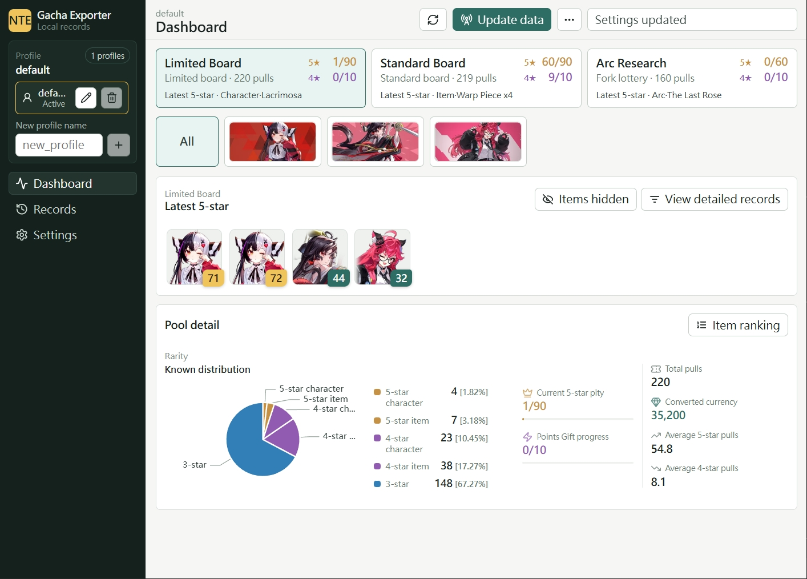

# NTE Gacha Exporter

[繁體中文](https://github.com/Anong0u0/nte_gacha_exporter/blob/master/README.md) | English

Captures NTE packets with Windows pktmon, exports `Limited board`, `Standard board`, and `Fork lottery` records, and generates JSON/CSV.

## Highlights

- Dashboard, Records browsing, and filters.
- `Auto page` support for capturing gacha records.
- Import, merge, back up, and export JSON/CSV data.
- Built-in multilingual output names: `de`, `en`, `es`, `fr`, `ja`, `ko`, `ru`, `zh-CN`, `zh-Hans`, `zh-Hant`.

## Quick Start

1. Download the latest `nte-gacha-exporter-version.zip` from [GitHub Releases](https://github.com/Anong0u0/nte_gacha_exporter/releases).
2. Extract the whole folder.
3. Open `nte-gacha-exporter.exe`.

## UI Preview

<p align="center">
  
</p>

## Requirements

- Windows 10 1809+ / Windows 11, WebView2 Runtime.
- Administrator permission is required.
- The NTE game must be running.
- `Auto page` requires the game window to be visible in the foreground, the gacha page opened manually with F3, and 16:9 / 1920x1080 is recommended.

## Usage

Open `nte-gacha-exporter.exe`, then click `Update data` in the upper-right corner.

Use the upper-right `...` menu to adjust `Update options`:

- `Auto page`: Incremental update by default. After an existing record is found, that pool is skipped.
- `Full update`: Re-reads all pages and creates a backup before import. Data is still merged by record.
- `WinDivert capture`: Uses WinDivert network-layer capture for VPN, proxy, or other paths pktmon cannot decode.

Before using `Auto page`, keep the game on the F3 gacha home screen with the lower-left file icon and `Arc Research` entry visible.
During execution, the tool controls the foreground game window and mouse. Avoid manual input that may interfere. Press Esc to abort when needed.

CLI Examples:

```powershell
.\nte-gacha-exporter-cli.exe capture --output-raw --json .\output\history.json --csv .\output\history.csv
.\nte-gacha-exporter-cli.exe capture --windivert --install-windivert --output-raw --json .\output\history.json --csv .\output\history.csv
.\nte-gacha-exporter-cli.exe replay .\output\raw-260611-153012.jsonl --json .\output\history.json --csv .\output\history.csv
.\nte-gacha-exporter-cli.exe doctor
```

## Output

Public JSON only contains export info and `nte.list` records:

```json
{
  "info": {
    "schema": "nte-gacha-export",
    "schema_version": "2.0",
    "locale": "en"
  },
  "nte": {
    "list": [
      {
        "record_id": "02539eac...",
        "source_order": 0,
        "record_type": "monopoly",
        "time": "2026-04-30 17:02:15",
        "pool_id": "CardPool_Character",
        "pool_name": "The Ichi-daime",
        "banner_id": "monopoly_limited_Nanali",
        "item_id": "Fashion_vehicle_1010_V008",
        "item_name": "Mod Parts·Tiger Incoming! - Livery",
        "rarity": 5,
        "count": 1,
        "roll_points": 2,
        "roll_label": "2"
      }
    ]
  }
}
```

JSON/CSV output uses localized field names for the selected language.

## Troubleshooting

The `Doctor` button on the settings page checks Windows, administrator permission, `HTGame.exe`, ports, and PPPoE status. When capture or `Auto page` fails, the status window may show `Raw path`, `support`, or `support image`. Include `data/support/capture-*.json` when reporting an issue. Page-number recognition issues may also include `*-page-number.png`.

### Could not find the WebView2 Runtime.

The app depends on the Windows system-level WebView2 Runtime. [Download](https://developer.microsoft.com/microsoft-edge/webview2/#download) and install it.

### `capture requires administrator privilege`

Reopen the tool with administrator permission.

### `HTGame.exe` is not found

Start NTE, confirm the game is still running, then reopen `nte-gacha-exporter.exe`.

### No records are written

Open the in-game gacha history screen so the game sends the relevant packets. For VPN or proxy, enable `WinDivert capture`.

## Development

```powershell
cargo xtask ci
cargo xtask quality
cargo agent launch # for dev runtime
```

## Credits

- [Waifus-Grace/NTE_Assets](https://github.com/Waifus-Grace/NTE_Assets) for exported game assets and localization data.

## License

[MIT](https://github.com/Anong0u0/nte_gacha_exporter/blob/master/LICENSE)
